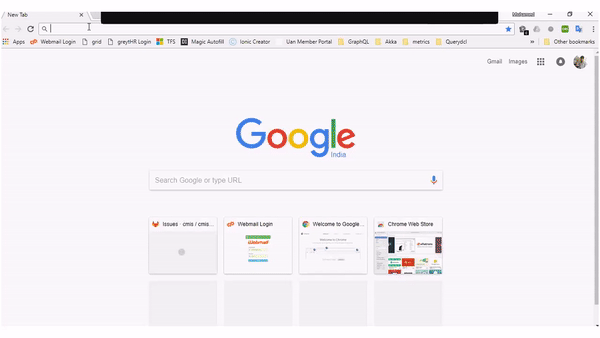

# Project Description

This project implements the [Swagger REST API definitions](https://swagger.io/specification/) for the OpenCMIS specifications. The models defined in types are used as properties and generate a dynamic swagger definition to consume it over HTTP REST. The below APIs are exposed for every type,

* GET (/getAll) - Retrieve one or many objects
* POST - Insert a new `cmis:folder` or `cmis:document` or `cmis:item`
* PUT  - Update an existing object based on ObjectID
* DEL  - Delete an existing object based on ObjectID

This gives us very easy consumption in client applications using simple HTTP APIs.



## Requirements
* Java 8 SDK
* Maven

# Getting Started

> Use Eclipse Neon to have better development experience.

* We will use the OpenCMIS InMemory server to test swagger-ui
    * Download war or full project get in this link https://chemistry.apache.org/java/developing/repositories/dev-repositories-inmemory.html
    * Download cmis workbench to check server is connected or not.Get the workbench through this link http://chemistry.apache.org/java/developing/tools/dev-tools-workbench.html.
* Build the swagger repo and generate jar/war file.
    * mvn clean package / mvn clean install
* Specify the following environment variables,

| Environment Variable       | VALUE         | Required             |
| ------------- |:-------------:| -----:|
| SWAGGER_CMIS_SESSION_CONNECTION_URL      | http://localhost:8080/ | true |
| SWAGGER_SERVER_PROPERTY_FILE_LOCATION      | src/main/resources/ | false |
| CUSTOM_TYPE_HAS_FOLDER      | '1' or '0' | false |

* Run that cmis-swagger.jar file to start the server.

```
java -jar cmis-swagger-1.0.0.jar -httpPort=8081
```
* Navigate to "http://localhost:8081" to load the swagger UI.
* Specify the CMIS repository. In this case since we are running OpenCMIS InMemory Server we can specify 'A1,A2' to load that.

> Note: CUSTOM_TYPE_HAS_FOLDER, this is a very specific CMIS implementation requirement and is not required when using with other CMIS server implementations.

## Customizing Swagger Information

* Define a custom information file as .properties and set the SWAGGER_SERVER_PROPERTY_FILE_LOCATION env variable,

```
serverDescription=The CMIS server defines JSON bindings for the domain model that can be used by applications to work with one or more Content Management repositories/systems.

serverVersion=1.0.0

serverTitle=CMIS API

serverContactEmail=xxx@gmail.com

serverName=CMIS 

serverUrl=http://www.apache.org/licenses/LICENSE-2.0.html

serverExternalDocumentDescription=Find out more

serverExternalDocumentUrl=https://chemistry.apache.org/project/cmis.html

```

## Roadmap

* Supporting versions
* Supporting policies
* Recursive GET for folders
